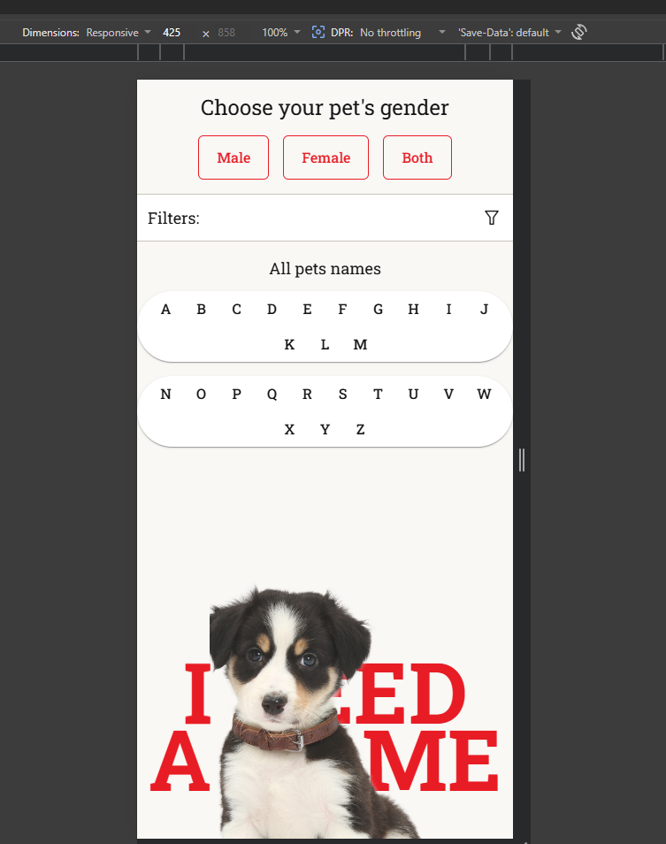

# Dog Name Generator

A simple and responsive dog name generator application available for **mobile**, **tablet**, and **desktop** views.

## Setup & Installation

```bash
npm install
```

## Running the Application

### Development Mode
Run the development server:

```bash
npm run dev
```

Open [http://localhost:3000](http://localhost:3000) in your browser to see the application.

### Production Build
Build and run for production:

```bash
npm run build
npm run start
```

## Configuration

The application uses a configuration system to manage data storage and network simulation.

### Storage Backend
By default, the application uses **jsonStorage** for API calls.

To use **Google Drive** instead, enable the feature flag in `app/config/environment.ts` (or the appropriate environment file for your mode).

### Network Simulation
The application includes a feature to simulate low network conditions for testing purposes. This can be configured in your environment configuration file.

### Setting the Configuration
Update the configuration in:
- `app/config/environment.dev.ts` - for development mode
- `app/config/environment.prod.ts` - for production mode
- `app/config/environment.ts` - for shared settings

## Responsive View

### Mobile View


### Tablet View

